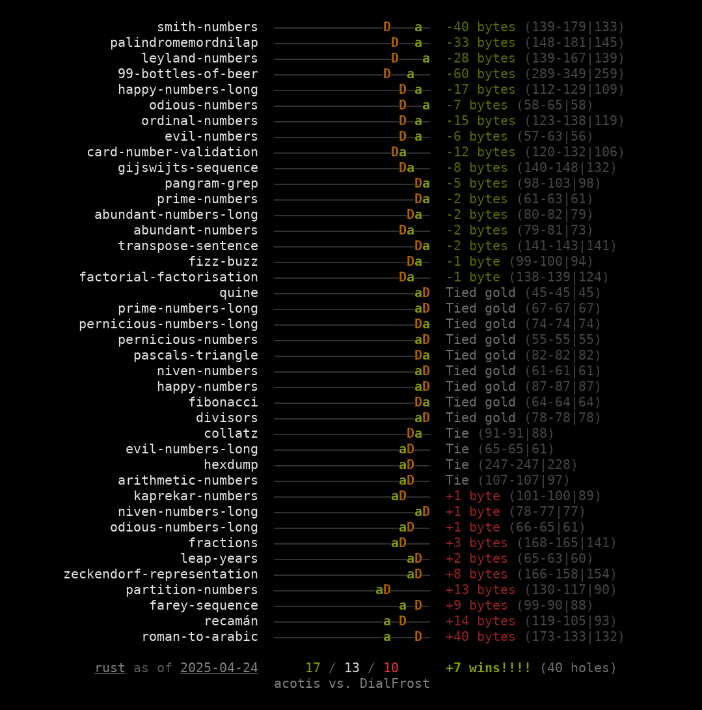

# Description

This tool generates head-to-head performance reports for comparing two users' standings on [code.golf](https://code.golf/). The reports look like this:



Each line lists a hole title, a score bar approximating your score and their score (out of 1000 points), and the number of bytes shorter or longer your solution is compared to theirs. In parentheses, it displays your solution's length, their solution's length, and the length of the shortest solution for that hole (the gold).

# Usage

To generate a report like the one above, download the file `holier` (for Linux) or `holier.exe` (for Windows) and run this command:

```
./holier acotis JayXon --lang rust
```

To generate a report based on how things stood on a particular day (defaults to today's date):

```
./holier acotis JayXon --lang rust --cutoff 2025-03-31
```

To use chars scoring (defaults to bytes otherwise):

```
./holier acotis JayXon --lang rust --scoring chars
```

To make the score bars wider or narrower (defaults to 20 characters, and the script will automatically adjust the width upwards by one character if it needs to do so to perfectly center-align everything):

```
./holier acotis JayXon --lang rust --score-bar-width 30
```

To leave more or less room for the hole names on the left side (defaults to 33 characters, which is just enough room to accommodate the longest hole name while leaving a margin of 1 character to the left):

```
./holier acotis JayXon --lang rust --hole-name-width 50
```

To include a third golfer's performance in the score bars as reference (can only include one additional golfer beyond the two being compared, and stats for that golfer are not printed beyond their appearance in the score bar):

```
./holier acotis JayXon --lang rust --reference xnor-gate
```

To reverse the order of the holes in the report:

```
./holier acotis JayXon --lang rust --reverse
```

## Note about timestamps

When you specify a cutoff timestamp **without a time**, the generated report includes solutions submitted through the **end** of the year, month, or day specified.

When you specify a cutoff timestamp **with a time**, the generated report includes solutions submitted **up to** that time.

For example:

- `2025` will include everything submitted through the end of 2025.
- `2025-03` will include everything submitted through the end of March 2025.
- `2025-03-31` will include everything submitted through the end of March 31st, 2025.
- `2025-03-31 12:00` will include everything submitted before March 31st, 2025 at 12:00:00.000000.
- `2025-03-31 12:15` will include everything submitted before March 31st, 2025 at 12:15:00.000000.
- `2025-03-31 12:15:17` will include everything submitted before March 31st, 2025 at 12:15:17.000000.

This system is designed to try to align with human intuitions about what the phrase "as of [date]" means.

# Warnings

This script is poorly-written and I feel bad :)

Generally speaking, you are on your own in terms of getting things right. If you specify a golfer that doesn't exist, you'll get an empty report. If you don't specify a language, it defaults to Rust. If you specify a `--hole-name-width` that's too narrow, the script will crash. If you specify a `--score-bar-width` that's too narrow, the script will crash. If you specify a `--lang` that doesn't exist, the script will hang, and then crash.

So, if you're getting results that don't look right, check your inputs carefully.

# Known bugs

This script has a known bug where, when using the `--cutoff` flag, the report may include solutions that have been invalidated or deleted. (Sometimes, a hole's submission judge will be made more strict in response to a cheese being discovered for that hole, and previously-existing solutions will be invalidated and removed from the site's leaderboard. Or, a golfer may simply choose to delete one of their solutions.) This bug occurs because code.golf's API offers precisely correct up-to-date data for the current moment, but only roughly correct historical data for the past. The historical data it provides does not include enough information to determine when a solution was invalidated/deleted and therefore at what cutoff it should be excluded from the report. Reports for the current moment are accurate because the API does provide a way to retrieve only those submissions which are currently valid and a golfer's best submission for that hole to date. **This all means that reports generated using the --cutoff flag may mis-report the number of "wins" and "losses" each player has.**

Feel free to submit a GitHub issue if you find other bugs.

